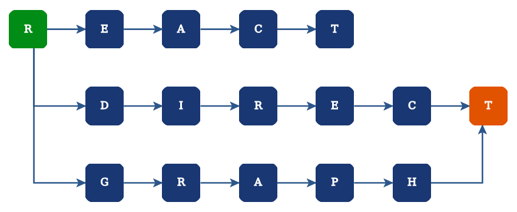

[](https://travis-ci.org/lempiy/react-direct-graph) [](https://www.npmjs.com/package/react-direct-graph) [](https://codeclimate.com/github/lempiy/react-direct-graph/maintainability) [](https://codeclimate.com/github/lempiy/react-direct-graph/test_coverage) [](https://standardjs.com)



> React component for drawing direct graphs with rectangular (non-curve) edge

## Examples

[Samples with code and preview](https://lempiy.github.io/react-direct-graph/)

## Install

```bash
npm install --save react-direct-graph
```

## Usage

```jsx
import React, { Component } from "react";

import DirectGraph from "react-direct-graph";

const graph = [
    {
        id: "A",
        next: ["B"]
    },
    {
        id: "B",
        next: ["C", "D", "E"]
    },
    {
        id: "C",
        next: ["F"]
    },
    {
        id: "D",
        next: ["J"]
    },
    {
        id: "E",
        next: ["J"]
    },
    {
        id: "J",
        next: ["I"]
    },
    {
        id: "I",
        next: ["H"]
    },
    {
        id: "F",
        next: ["K"]
    },
    {
        id: "K",
        next: ["L"]
    },
    {
        id: "H",
        next: ["L"]
    },
    {
        id: "L",
        next: ["P"]
    },
    {
        id: "P",
        next: ["M", "N"]
    },
    {
        id: "M",
        next: []
    },
    {
        id: "N",
        next: []
    }
];

export class ExampleBasic extends Component {
    render() {
        const { cellSize, padding } = this.props;
        return (
            <DirectGraph list={graph} cellSize={cellSize} padding={padding} />
        );
    }
}
```

## License

MIT © [lempiy](https://github.com/lempiy)
